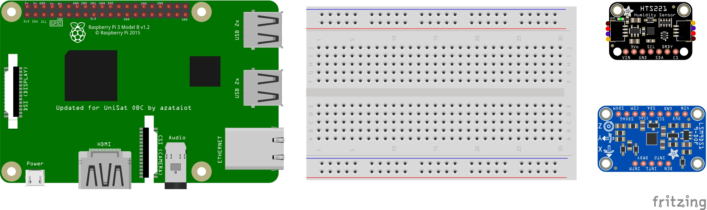

# fritzing-obc-blank
Стартовые файлы для https://github.com/UNEPG/fritzing-obc 

## Работа с файлами

1. Загрузите репозиторий с Github.
2. Разархивируйте файлы на рабочий стол. 
3. Дважды щелкните, чтобы открыть файл `fritzing-obc.fzz`. 
4. Как мы объясняли ранее, I2C - это простой двухпроводной последовательный протокол. Для связи с любым датчиком i2c нам необходимо подключить их линии SDA и SCL, а также подключить их к сети через линии VCC и GND.
5. Теперь давайте подключим линии VSS датчиков к Raspberry Pi. В электронике принято использовать красный цвет в качестве цвета по умолчанию для VSS. 
6. И мы используем черный провод для подключения GND. 
7. Давайте также подключим тактовую линию I2C, используя белый цвет. 
8. Наконец, давайте подключим линию передачи данных I2C с помощью зеленых проводов. 

Поздравляем! Таким образом, вы успешно создали свою первую печатную плату с помощью Fritzing.

## Справочные материалы

1. https://prodigytechno.com/i2c-vs-spi/#:~:text=I2C%20is%20half%20duplex%20communication%20and%20SPI%20is%20full%20duplex%20communication.&text=I2C%20supports%20multi%20master%20and%20multi%20slave%20and%20SPI%20supports%20single%20master.&text=I2C%20is%20a%20two%20wire,is%20a%20four%20wire%20protocol.&text=I2C%20supports%20clock%20stretching%20and%20SPI%20does%20not%20have%20clock%20stretching. 
2. https://www.youtube.com/watch?v=iKDeJi2VBNo    (Youtube-канал Prodigy Technovations)

