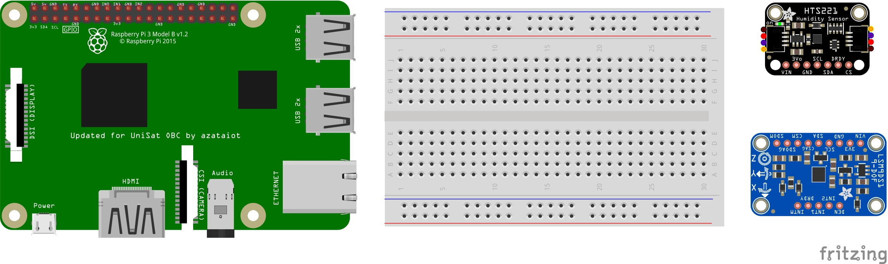

# fritzing-obc-blank
Starter files for https://github.com/UNEPG/fritzing-obc 

## Working with the Files

1. Download the repository from Github.
2. Unzip the files to the desktop. 
3. Double click to open the `fritzing-obc.fzz` file. 
4. As we have explained earlier,  I2C is a simple two-wire serial protocol. To communicate with any i2c sensor, we need to connect their SDA and SCL lines and also need to power them via VCC and GND lines.
5. Now let's connect the VSS lines of the sensors to the Raspberry Pi. It is a standard in electronics to use the red color as the default color for the VSS. 
6. And we use black wire to connect the GND. 
7. Let's also connect the I2C clock line using the white color 
8. Finally, lets connect the I2C data line using green wires. 

That's Done! by doing so, you have successfully created your first PCB using Fritzing.

## Reference Materials

1. https://prodigytechno.com/i2c-vs-spi/#:~:text=I2C%20is%20half%20duplex%20communication%20and%20SPI%20is%20full%20duplex%20communication.&text=I2C%20supports%20multi%20master%20and%20multi%20slave%20and%20SPI%20supports%20single%20master.&text=I2C%20is%20a%20two%20wire,is%20a%20four%20wire%20protocol.&text=I2C%20supports%20clock%20stretching%20and%20SPI%20does%20not%20have%20clock%20stretching. 
2. https://www.youtube.com/watch?v=iKDeJi2VBNo    (Youtube Channel Prodigy Technovations)

